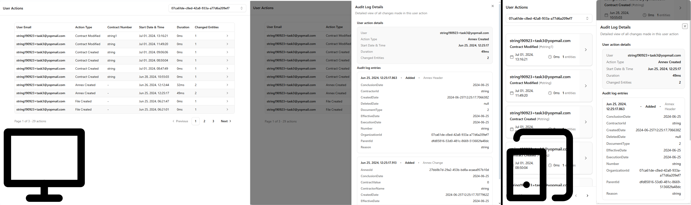

# Audit Log Analytics

Full-stack application that transforms granular audit log entries into aggregated user actions, enabling organizations to track who changed what, when, and how long operations took. Groups related database changes by correlation ID into cohesive action views with pagination and drill-down capabilities.

**[Live preview](https://publink-task-b9d5gzgbf3dmbzgu.westeurope-01.azurewebsites.net)** (Azure App Service - Free tier)


## Tech Stack

**Backend**: ASP.NET Core 9.0 (Minimal APIs) · PostgreSQL · EF Core 9.0 · xUnit + Testcontainers

**Frontend**: React 19 · TypeScript 5.9 · SWR · Vite · Tailwind CSS + shadcn/ui

**Tools**: Miro (planning) · Claude (data analysis) · Python (data exploration)

## Workflow
1. **Analysis and research**: [Miro board](https://miro.com/app/board/uXjVJuf7bEo=/?share_link_id=650619966351)
   * Data structure analysis (tables schema, manual SQL queries, data analysis with claude through python scripts)
   * UI/UX research (articles reading to better understand usage of audit logs, UI designs)
2. **Programming full-stack app** (.NET + React) - check commit messages for details

## Assumptions
1. Audit logs correlation_id is never null
2. All entries with same correlation_id have same user_email and organization_id
3. First audit log entry determines action type (could be more detailed by determining action by the whole sequence of actions not only by the first one)
4. First audit log entry matters for Contract Number (from Contract Header)

## Technical decisions

**Rationale:** Simple solution optimized for current dataset size (~2k entries), code readability, and delivery time.

### Backend
- **Minimal APIs over Controllers** - Lightweight for 3 endpoints, reduced boilerplate, vertical slice architecture
- **No CQRS/MediatR** - Simple read-only operations don't justify abstraction overhead (YAGNI principle)
- **No Repository pattern** - EF Core already provides abstraction; additional layer would be redundant
- **Integration tests over unit tests** - Test against real PostgreSQL with Testcontainers for query accuracy
- **Hybrid approach** - EF Core for simple queries + raw SQL for complex aggregations

### Frontend
- **SWR over Redux** - Built-in caching and stale-while-revalidate perfect for read-heavy app; simpler than Redux
- **Context API for global state** - Simple organization selection doesn't need Redux complexity
- **Valibot over Zod** - Smaller bundle size with runtime API response validation
- **Adaptive components over responsive CSS** - Separate mobile/desktop components for better UX (cards vs table)
- **shadcn/ui** - Own the components (not npm dependency), Tailwind-based, accessible via Radix UI

## Scaling options

Current architecture supports ~2k entries efficiently. For scaling to millions of entries or high-traffic scenarios:

### 1. CQRS with Read Model (Monolith)
- Build read-optimized projection table (pre-aggregated `user_actions`)
- Background worker processes `audit_log` entries to update projection
- Maintains single-service deployment while separating read/write concerns

### 2. Caching Layer
- Redis cache for aggregated user actions
- HTTP caching headers (ETag, Cache-Control)
- Works independently with any architecture

### 3. Event Sourcing + CQRS + Microservices
- Treat `audit_log` as event store (append-only source of truth)
- Separate Audit Write Service and Audit Query Service
- Message queue for event distribution between services
- Independent service scaling with multiple specialized read models

## Requirements Checklist

* ✓ User email displayed
* ✓ Action type identification
* ✓ Contract number (when ContractHeaderEntity involved)
* ✓ Action start date/time
* ✓ Action duration calculation
* ✓ Changed entities count
* ✓ Pagination (10 per page)
* ✓ Descending date sort
* ✓ Organization filtering

# Development setup

## Prerequisites

- .NET 9.0 SDK
- Node.js 18+ and npm
- PostgreSQL database

## Database Setup

Update the connection string in `AuditLog/appsettings.json`:

```json
"ConnectionStrings": {
  "DefaultConnection": "Server=localhost;Database=RekrutacjaDb;Username=your_user;Password=your_password"
}
```

## Running Locally

### Backend API

```bash
cd AuditLog
dotnet run --launch-profile https
```

API will be available at:
- HTTPS: `https://localhost:7041`
- HTTP: `http://localhost:5292`

### Frontend

```bash
cd AuditLog.Client
npm install
npm run dev
```

Frontend will be available at: `http://localhost:5173`

## Running Tests

```bash
dotnet test AuditLog.SystemTests
```

Tests use Testcontainers with PostgreSQL and run sequentially to avoid database conflicts.

## API Endpoints

- `GET /api/v1/organizations` - Get distinct organization IDs
- `GET /api/v1/organizations/{organizationId}/user-actions?page=1&pageSize=10` - Get paginated user actions with metadata
- `GET /api/v1/organizations/{organizationId}/user-actions/{userActionId}/audit-logs` - Get detailed audit log entries for a specific user action
